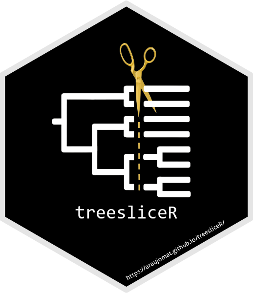
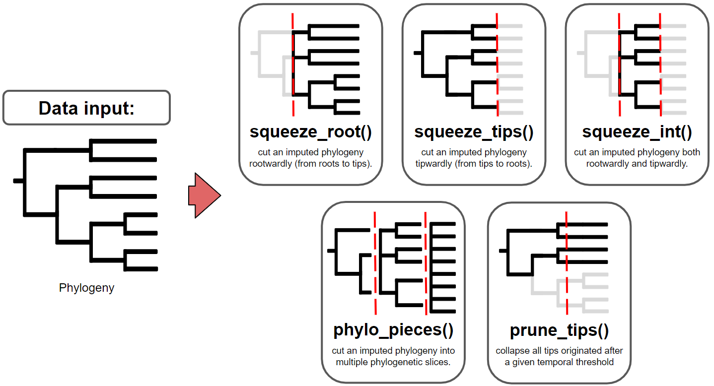

<!-- README.md is generated from README.Rmd. Please edit that file -->

<a href="https://araujomat.github.io/treesliceR/"></a>

# treesliceR

<!-- badges: start -->

[](https://choosealicense.com/licenses/mit/)
<!-- badges: end -->

## Overview

The biodiversity patterns that we currently observe on Earth have been
continuously shaped by evolutionary dynamics over longer periods of
time. Thus, the historical dynamics experienced by a particular clade
during its evolution are crucial to understand its current patterns, and
many of these significant historical influences are widely distributed
and imprinted across extant phylogenies. Alternatively, solely focusing
on macroevolution dynamics overlooks important and complex patterns that
emerge due to biogeographical processes. For instance, these dynamics
may differ among assemblages due to various constraints experienced over
time, resulting in distinct phylogenetic histories stored within them.
However, dissecting phylogenies to comprehend the contributions of
cladogenesis events from different depths on a given pattern has been
challenging until now, given the lack of tools readily providing this
type of information.

The primary goal of **treesliceR** is to provide a wide range of
functions capable of *cutting phylogenies at any evolutionary depth*
(Figure 1). These cutted phylogenies can be used by users to explore
various evolutionary patterns stored at different temporal depths, as
well as any other information derived from these pruned phylogenies. To
ensure a more accessible and user-friendly processes for obtaining these
pruned phylogenies, **treesliceR** functions offer multiple criteria for
making slices based on users requirements. For instance, it enables
users to cut phylogenies in different orientations, such as ‘rootwardly’
(from root to tips) and ‘tipwardly’ (from tips to its root), or simply
obtain a phylogenetic slice within a specific time interval of interest.
Alternatively, multiple phylogenetic slices of equal width can be
produced, similar to a time-series, based on user-input temporal
criteria, which can be expressed in either millions of years or in terms
of phylogenetic diversity.

<div class="figure">


<p class="caption">
Figure 1: This figure provides illustrated examples of the functions for
slicing phylogenies available within treesliceR. The red dashed lines
indicate hypothetical temporal thresholds input by the user.
</p>

</div>

The second goal of **treesliceR** is to provide functions that
facilitate the assessment of a novel family of *rates of accumulation
through time for any phylogenetic index* (Figure 2). The rationale
behind these rates is that most currently available indexes do not
differentiate the contributions of lineages at different depths to a
given observed pattern. This implies that the same value of a particular
phylogenetic index can be obtained through different configurations of
species compositions and tree topologies. For instance, a high
phylogenetic diversity observed within an assemblage could result from a
few deep lineages or a high richness of recent lineages. Therefore,
**treesliceR** offers functions for calculating the accumulation of a
given phylogenetic pattern (e.g., PD, PE, Pβ…) through time to elucidate
the main lineages depths responsible for generating it. For more
detailed information regarding the mathematical procedures behind these
rates, please refer to [Araujo et al. (under
review)](https://github.com/AraujoMat/treesliceR).

<div class="figure">


<p class="caption">
Figure 2: This figure provide illustrated examples of the available
functions for calculating rates of accumulation of phylogenetic indexes,
assessing their most parsimonious number of slices to model these rates
(i.e., sensitivity analysis), and presenting their graphical outputs.
The figure demonstrates the functions for obtaining only the rates of
accumulations of phygeloenetic β-diversity (Cpβ) as an example, but
these rates can also be applied to other phylogenetic indexes (for more
details, see treesliceR CRAN).
</p>

</div>

**treesliceR** is an easy-to-use and open-access R package that is
continuously evolving, with the goal of becoming a standard toolbox for
users interested in temporally dissecting any phylogenetic information.
It strives to continually develop innovative methods to reveal
previously concealed phylogenetic patterns over the evolutionary time.
The package was developed following user-friendly software development
practices, offering functions with core parallelization, detailed error
messages in case of failures, and graphical functions that can rapidly
generate ready-to-publish figures. Nevertheless, **treesliceR** is
freely maintained on GitHub, where its user community can directly
engage with maintainers to report bugs, contribute improvements to our
existing algorithms through pull request, or even propose novel ideas
for future functions.

## Installation

If you are interested in using the **treesliceR** tools in your classes
or research, you can install the
[CRAN](https://cran.r-project.org/package=treesliceR) (Comprehensive R
Archive Network) version simply by typing:

``` r
install.packages("treesliceR")
```

Alternatively, you can install the development version of **treesliceR**
from [GitHub](https://github.com/) by typing:

``` r
devtools::install_github("AraujoMat/treesliceR")
```

Now, you are ready to temporally dissect any phylogenetic pattern of
interest! For more detailed information, visit our
[CRAN](https://cran.r-project.org/package=treesliceR)!

## Examples

To learn about various ways to use and solve problems using
**treesliceR**, you can explore some of our vignettes:

- [Introduction to
  treesliceR](https://araujomat.github.io/treesliceR/articles/Intro-treesliceR.html):
  This section provides straightforward and beginner-friendly
  applications with simple illustrations of the tools available within
  the package;
- [Passerines
  distribution](https://araujomat.github.io/treesliceR/articles/Passeriformes-distribution.html):
  Here, you’ll find an applied example of our tools focusing on
  Australian passeriformes, where we compare species richness
  distributions between older and more recent lineages;
- [Passerines
  diversification](https://araujomat.github.io/treesliceR/articles/Passeriformes-diversification.html):
  In this vignette, we replicate the case study by [Araujo et al. (in
  review)](https://github.com/AraujoMat/treesliceR). It presents the
  workflow executed for both a single phylogeny and multiple sampled
  phylogenies for passeriformes.

## Getting help

Encountering issues with certain **treesliceR** functions on your
computer? Please report these bugs with a minimal reproducible example
on the package’s
[GitHub](https://github.com/AraujoMat/treesliceR/issues) page. If you
have suggestions for improving our algorithms, don’t hesitate to submit
your ideas through pull requests.

If you have intriguing ideas for exploring phylogenetic information
temporally, please feel free to contact us via email at:
*<matheusaraujolima@live.com>*. You can track our commit updates and
version controls directly on
[GitHub](https://github.com/AraujoMat/treesliceR/commits/).
